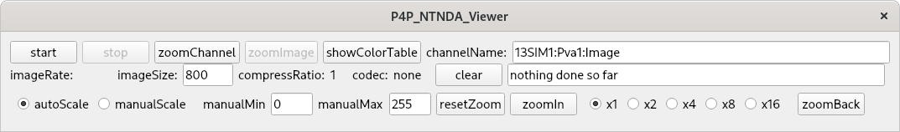
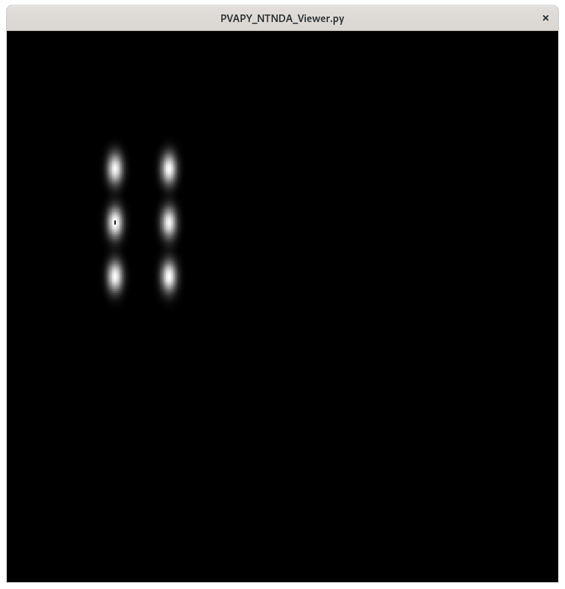
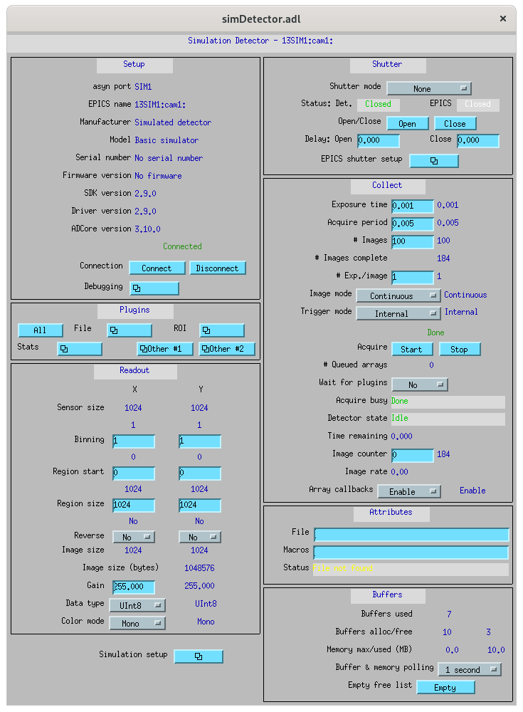
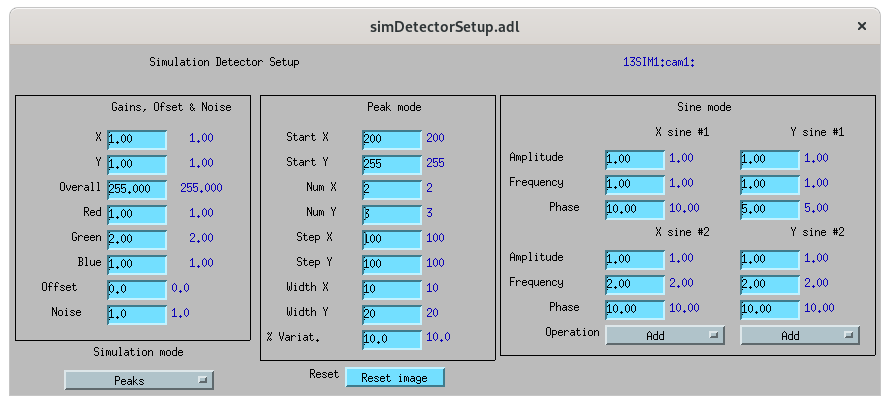
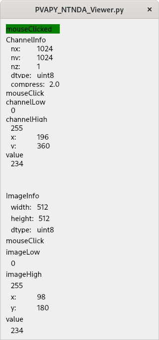

# PY_NTNDA_Viewer

PY_NTNDA_Viewer is Python code that is similar to the Java EPICS_NTNDA_Viewer that comes with areaDetector.

Author: Marty Kraimer
Date: 2020.09.02

## Overview

PY_NTNDA_Viewer is Python code that is similar to the Java EPICS_NTNDA_Viewer that comes with areaDetector.

It is available in [ADViewers](https://github.com/areaDetector/ADViewers)

It is a viewer for images obtained from an areaDetector pvAccess channel that provides an NTNDArray.

There are currently 2 versions:

1. P4P_NTNDA_Viewer.py This uses p4p.
2. PVAPY_NTNDA_Viewer.py This uses pvaPy.

Both are supported on Windows, Mac OSX, and Linux.

Below there are instructions for

1. Starting the example
2. Installation of required Python modules.

## User Interface

When either version is started the following control window appears:

When start is pressed the following appears:

### First row of control window

- start Clicking this button starts communication with the server
- stop Clicking this button stops communication with the server
- showInfo Clicking this brings up the showInfo window. See below for details.
- showColorTable Clicking this brings up the ColorTable window. See below for details
- channelName This is the name of the channel that provides the NTNDArray. When in stopped mode a new channel name can be specified.

### Second row of control window

- imageRate This shows the number of images/second that are being displayed. Note that this is normally less than the number of images the server is producing.imageRate.
- imageSize
- compressRatio
- codec
- clear

### Third row of control window

- autoScale
- manualScale
- manualMin
- manualMax
- resetZoom
- zoomIn
- x1,...,x16
- zoomBack

## Suggested simDetector setup

### Main window

### commonPlugins

### Simulation Setup

### NDCodec

## Image Zoom

## showInfo

## Color Table

