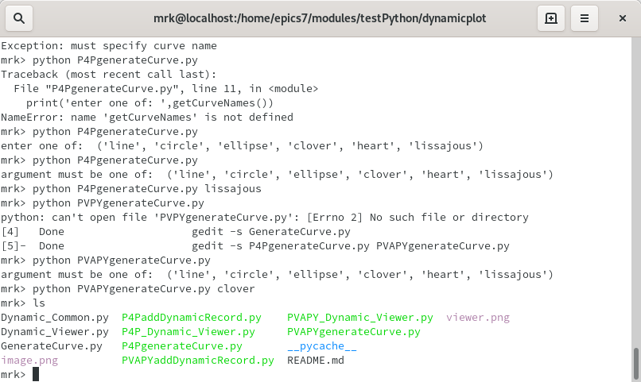

# testPython/dynamicplot 2020.03.11

This is code that produces plots similar to **testPython/matplot** but dynamically.
Dynamically means that the viewer shows the curve growing as the number of points increases.

In addition an attempt is made to do everything using both pvapy and p4p,
which are two different python wrappers for pvAccess/pvData.

Below problems are described that discusses some problems with pvapy and p4p.

Below there are instructions for

1) Starting the example
2) Installation of required Python modules.

## User Interface

When either version of the viewer is started the following appears:

When **start** is pressed the following appears

### First row of control window

1) **start**
Clicking this button starts communication with the server.
2) **stop**
Clicking this button stops communication with the server.
3) **channelName**
This is the name of the channel that provides the DynamicArray.
When in stopped mode a new channel name can be specified.

### Second row of control window

1) **npts**
This is the number of (x,y) points for the current image.
2) **providerName**
This is the name of the current curve being displayed/
3) **status**
This shows current status.
Clicking **clear** erases the current status.

## Starting the example

### Starting example database.

Start an IOC running the example database
For example I start it as follows

    mrk> pwd
    /home/epics7/modules/exampleCPP/database/iocBoot/exampleDatabase
    mrk> ./../bin/linux-x86_64/exampleDatabase st.cmd

One of the records is one to add new records.

    mrk> pvinfo PVRaddRecord
    structure
        structure argument
            string recordName
            any union
        structure result
            string status

### Create dynamicRecord

Just issue the following:

    python addDynamicRecord.py

Note that name for the record added is **dynamicRecord**.
This can be changed by setting an environment variable **DYNAMIC_VIEWER_CHANNELNAME**.

The added record is :

    mrk> pvinfo dynamicRecord
    structure
        string name
        double[] x
        double[] y
        double xmin
        double xmax
        double ymin
        double ymax

### start P4P_Dynamic_Viewer or PVAPY_Dynamic_Viewer

For example:

    mrk> python P4P_Dynamic_Viewer.py

You will see errors if You have not installed all the python packages required.
If it shows no errors click connect and start.

Then run any of the curve generating python modules. For example

    mrk> python P4Pcircle.py

On the viewer a circle appears.

## Required python modules

You must have python and pip installed.

The other python modules can be installed via **pip install ...**

For example issue the command

    sudo pip install numpy

The following shows all installed python modules

    pip list

The following is a list of modules required by PY_Dynamic_Viewer

1) numpy
2) PyQt5
3) PyQt5-sip
4) QtPy
5) p4p and/or pvapy
6) pyqtgraph

## Theory of Operation

## Problems

### Neither P4P_addDynamicRecord.py or PVAPYaddDynamicRecord.py work

### PVAPYaddDynamicRecord.py does not show complete dynamic image

