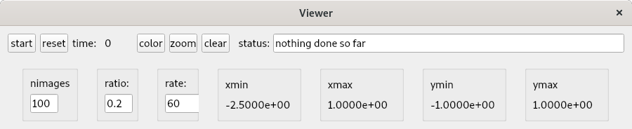
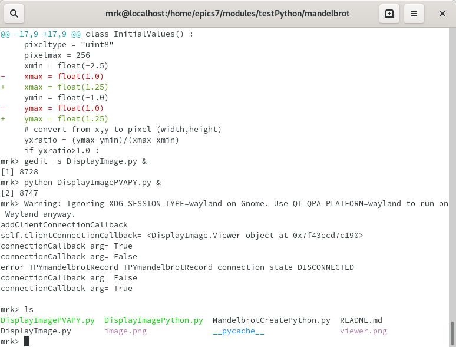

# testPython/mandelbrot 2020.04.15

This is code that produces a mandelbrot image

## User Interface

When the following is entered

    python mandelbrot.py

The following appears:

When **start** is pressed the following appears after awhile. BE PATIENT

After the image appears you can use the mouse to select a sub-image.
Just depress the mouse in the image, drag it in lower right direction, and release.
After awhile the subimage will appear.

## Future Plans

Another version will be created that uses **pvaPy** to connect to a PVRecord that calculates the image.
